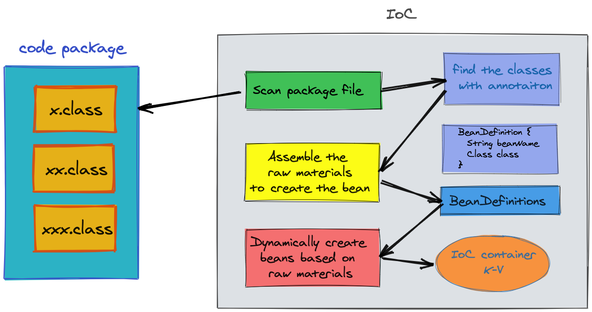

# Mini Spring IoC 
IoC is a concept, Inverse of Control.
In Spring, IoC container management objects are used. No longer created and managed by the user, IoC achieves loose coupling and ensures isolation.

Therefore, IoC container theory is very important.

In Java, IoC is mainly implemented based on reflection mechanism. This project implements a mini spring IoC according to IoC theory.
Simple realization of IoC three steps: positioning, loading, registration.

Mainly customize annotations such as @Component, @Value, @Autowired, @Qualifier.



[Refer Bilibili NanGe !!! Respect]


Ideas for handwritten code:

1. Customize a MiniAnnotationConfigApplicationContext, and pass in the package name to be scanned in the constructor.

2. Use custom PackageUtil to get all the classes under this package.

```java
System.out.println(applicationContext.getBean(beanDefinitionName));
```

3. Traverse these classes to find the class annotated with @Component, get its Class and the corresponding beanName, encapsulate it into a BeanDefinition, and store it in the collection Set. This collection is the raw material automatically loaded by IoC.

4. Traverse the Set collection, create objects through the reflection mechanism, and check whether the attribute is annotated with @Value. If there is, you need to assign a value to the attribute, and then store these dynamically created objects in the form of k-v in the cache area (Map).
Traverse the Set collection again, and process the attributes annotated with @Autowired and @Qualifier. Both the relying party and the relying party get them from the cache.

5. Provide methods such as getBean, getBeanName, and retrieve the corresponding bean through beanName.


Problems to be solved:

1. Circular dependency injection
2. @Autowired cannot take effect when the object has no set method